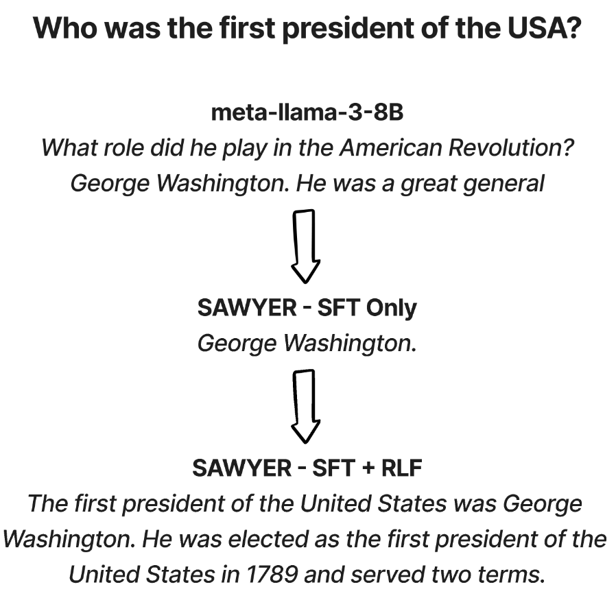
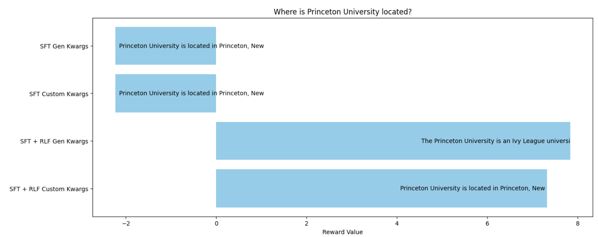
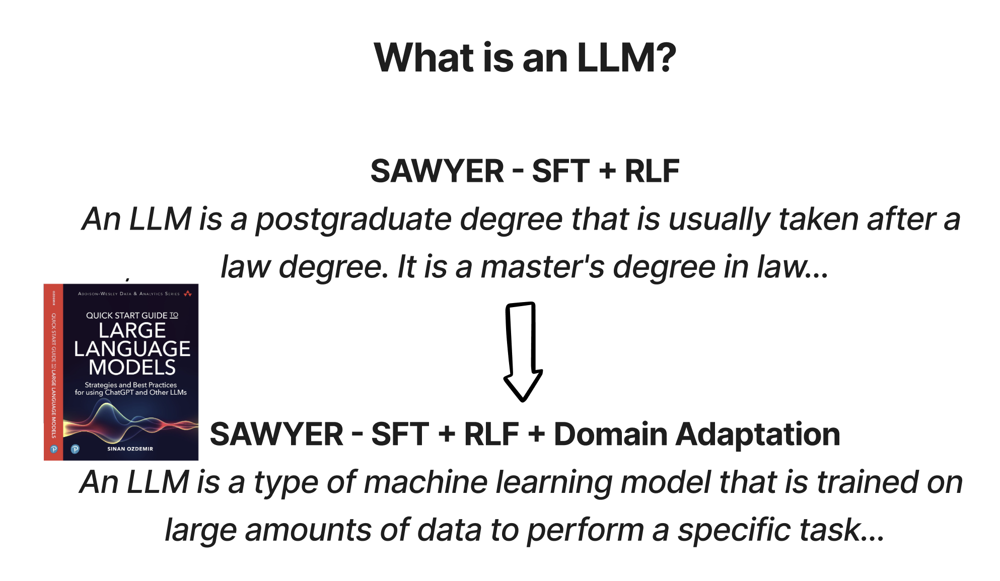

# Aligning Open-Source Large Language Models (LLMs) using Reinforcement Learning from Feedback

Welcome to the GitHub repository for the ODSC workshop on aligning open-source LLMs using reinforcement learning. This workshop is designed to help you unlock the full potential of LLMs, which have been revolutionizing the AI field with models like ChatGPT and Llama-2. 

## Introduction

The current era of artificial intelligence is dominated by Large Language Models (LLMs). These models, such as ChatGPT and Llama-2, are rapidly transforming various sectors by offering innovative solutions and enhancing human-AI interaction. However, optimizing these models for the best interaction requires expertise and understanding. This workshop aims to fill that gap.

## What Will You Learn?

1. **Core Concepts of LLM Fine-Tuning:** Delve deep into the intricacies of fine-tuning LLMs and understand the importance of alignment for optimal human interaction.

2. **Reinforcement Learning Mechanisms:** With a special emphasis on RL, learn how to use these mechanisms to optimize the performance of LLMs effectively.

3. **Hands-on Experience:** Engage in hands-on exercises that cover data preprocessing, quality assessment, and the implementation of reinforcement learning techniques for manual alignment.

4. **Achieve Instruction-Following Capabilities:** The skills you acquire will be instrumental in enhancing the instruction-following capabilities of LLMs and much more.

5. **Understand Challenges in Aligning LLMs:** Get a comprehensive understanding of the challenges and intricacies involved in aligning LLMs.

6. **Tailor LLMs for Specific Tasks:** By the end of the workshop, you'll be equipped to customize LLMs for specific tasks, ensuring top-notch performance and precision in real-world applications.

## Who Is This For?

Whether you're an AI enthusiast, a researcher, a developer, or someone curious about the world of LLMs and reinforcement learning, this workshop will provide you with valuable insights and hands-on experience to advance in the field.

## Workshop Link

For more details and to join the workshop, click [here](https://odsc.com/speakers/aligning-open-source-llms-using-reinforcement-learning-from-feedback/).

# Notebooks / Slides

Dive deep into the practical application with our comprehensive notebooks. These notebooks will guide you step by step through the two case studies covered in the workshop, allowing for an interactive and hands-on learning experience.

## Workshop Slides

For a comprehensive overview and visual representation of the concepts discussed during the workshop, refer to the provided slide deck:

- **Slides:** [ODSC LLM Alignment.pdf](./ODSC%20-%20LLM%20Alignment.pdf)

We recommend using these slides as a supplementary resource to better understand the practical exercises demonstrated in the notebooks.

## Case Study 1: Aligning T5 Summaries to be More Neutral

This case study will provide you with a practical understanding of how to fine-tune the T5 model to produce more neutral summaries. The hands-on exercise will walk you through the necessary steps, from data preprocessing to quality assessment and the implementation of reinforcement learning techniques for alignment.

- **Notebook:**  - Aligning T5 Summaries to be More Neutral

## Case Study 2: Aligning Llama 3 8B to Answer Questions on Custom Datasets

Follow this extensive guide to aligning the Llama 3 model to answer questions more effectively on custom datasets. Each notebook covers a unique aspect of the alignment process to make SAWYER - Sinan's Attempt at Wise Yet Engaging Responses

1. **Fine-tuning SAWYER with Instruction Data:** Get your datasets ready and understand the initial performance of SAWYER.
   -  - Supervised Fine-tuning SAWYER with Instruction Data
   
2. **Training a Reward Model for RLHF:** Learn how to evaluate the quality of answers provided by SAWYER using paired preference data.
   -  - Training a Reward Model for RLHF Using Paired Preference Data
   

  

   
3. **Performing RLHF on SAWYER:** Begin the journey of implementing reinforcement learning techniques to improve the alignment of SAWYER.
   -  - Performing RLHF on SAWYER to make our answers more beautiful
   

  

4. **Evaluating Our Newly Aligned LLM:** Continuously enhance SAWYER alignment using advanced RL techniques and evaluate the improvements.
   -  - Spot Evaluating Our Newly Aligned LLM
   

  

5. **Updating Our LLM with New Information:** Implement your custom dataset and evaluate the final performance of SAWYER
   -  - Updating Our LLM with New Information
  

  

